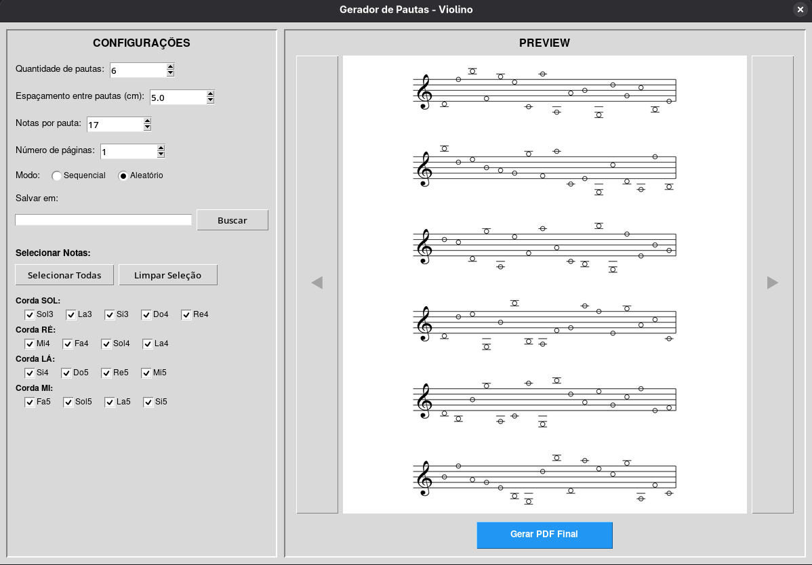

# Gerador de Pautas - Violino



Aplicação gráfica para gerar pautas de violino em PDF com interface intuitiva.

**Nota:** Atualmente, o gerador suporta apenas pautas de violino com clave de sol. No futuro, serão adicionadas outras claves musicais para suportar diferentes instrumentos.

## Requisitos do Sistema

### Linux

#### Fedora
```bash
sudo dnf install python3-tkinter
```

#### Ubuntu/Debian
```bash
sudo apt-get install python3-tk
```

#### Arch Linux
```bash
sudo pacman -S tk
```

### Windows

O tkinter já vem instalado com o Python no Windows. Se você estiver usando uma instalação personalizada do Python, pode ser necessário instalar manualmente ou reinstalar o Python com a opção "tcl/tk and IDLE" marcada.

## Instalação

1. **Instale o tkinter no sistema** (necessário antes de instalar as dependências Python):

   **Fedora:**
   ```bash
   sudo dnf install python3-tkinter
   ```

   **Ubuntu/Debian:**
   ```bash
   sudo apt-get install python3-tk
   ```

   **Windows:**
   - Normalmente já vem instalado com o Python
   - Se necessário, reinstale o Python marcando a opção "tcl/tk and IDLE"

2. **Instale as dependências Python:**

   ```bash
   pip install -r requirements.txt
   ```

   **Nota importante:** Se você instalou o tkinter após já ter o Pillow instalado, pode ser necessário reinstalá-lo:
   ```bash
   pip install --upgrade --force-reinstall Pillow
   ```

3. **Execute a aplicação:**

   ```bash
   python3 main.py
   ```

   **Windows:**
   ```bash
   python main.py
   ```

## Funcionalidades

- Seleção de notas por corda (SOL, RÉ, LÁ, MI)
- Modo sequencial ou aleatório
- Preview do PDF antes de gerar
- Escolha do local de salvamento
- Interface gráfica intuitiva com tkinter
- Configuração de quantidade de pautas, espaçamento, notas por pauta e número de páginas

## Estrutura do Projeto

```
gerador_pauta/
├── main.py                 # Ponto de entrada da aplicação
├── README.md               # Este arquivo
├── requirements.txt        # Dependências Python
├── assets/                 # Arquivos de recursos
│   ├── clave_de_sol.png   # Imagem da clave de sol
│   └── interface.png      # Imagem da interface
└── src/                    # Código fonte
    ├── config/             # Configurações e constantes
    │   └── settings.py
    ├── core/               # Lógica principal
    │   ├── note_helpers.py # Funções auxiliares de notas
    │   └── pdf_generator.py # Geração de PDF
    └── gui/                # Interface gráfica
        ├── app.py          # Aplicação principal da GUI
        └── widgets.py      # Widgets personalizados
```

## Compatibilidade

O programa foi desenvolvido para ser multiplataforma e funciona em:
- Linux (Fedora, Ubuntu, Debian, Arch e outras distribuições)
- Windows 10/11

Todos os caminhos de arquivo utilizam `os.path.join()` para garantir compatibilidade entre sistemas operacionais.
